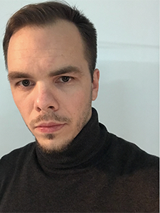

## Безматерных Никита Сергеевич 
Мужчина, 33 года  
родился 30 января 1990

+7(900)-658-01-88  
nikitabit@yandex.ru

**Проживает**: Москва  
**Гражданство**: Россия  
Готов к переезду, готов к редким командировкам

### **Python backend developer**

**Специализации:** Программист, разработчик  
**Занятость**:полная занятость,   
**График работы:** полный день, гибкий график, удаленная работа  

#### Опыт работы 11 лет 3 месяца

## Трудовой стаж

**Январь 2020 — по настоящее время**
Фрилансер
Программист, Web-дизайнер,   
- Cамостоятельная деятельность на фрилансе в качестве программиста 1с, фотографа и дизайнера.

**Ноябрь 2013 — октябрь 2019**
Федеральный центр высоких медицинских технологий г. Калининград  
Ведущий программист 1C  
- Начав с должности программиста, дошел до руководителя отдела программирования. 
- В мои задачи входила разработка и внедрение, обслуживание медицинской информационной системы. 
- Работал в команде с 2 коллегами, по сути выполнял работу тимлида.  

**Январь 2012 — декабрь 2013**

"Бюро технологий" г. Калининград  
Инженер-программист  
- Начал карьеру IT в 2010 году во франчайзе 1С.  
- Обновлял конфигурации 1с;  
- Консультировал клиентов;  
- Занимался продажами, внедрением, сопровождением и доработкой систем 1с  

## Обо мне
Более 6 лет в области IT, еще 4 года в смежных сферах.

Хотя мой основной "боевой" опыт не связан именно с Python, но я обладаю необходимым фундаментальными знаниями и сильной мотиваций для быстрого развития в команде.

#### Последний год занимаюсь обучением новому стеку технологий, Python c использованием:
- Django, DRF;
- FastAPI;
- Git;
- Docker;
- PostgreSQL;

#### Среди прочего:
- Читаю проф литературу подписан на телеграм и YouTube каналы где слежу за обновлениями и новыми релизами в сфере IT;
- Изучаю паттерны;
- Грокаю алгоритмы;
- Прохожу курсы на разных образовательных платформах;
- Больше 60 задач на Leetcode и 100+ на Сodewars;

Я визуал пишу красиво и понятно, сторонник конструктивной критики и постоянного обучения. Не люблю долги, стараюсь все исполнять в срок. Сейчас цель - найти место в команде где буду, решая сложные задачи, приносить пользу и развиваться как профессионал.  
Живу в + 4 часа к Москве и ищу удаленную работу на полной занятости.  

Ссылка на [GITHUB](https://github.com/NikBez)
